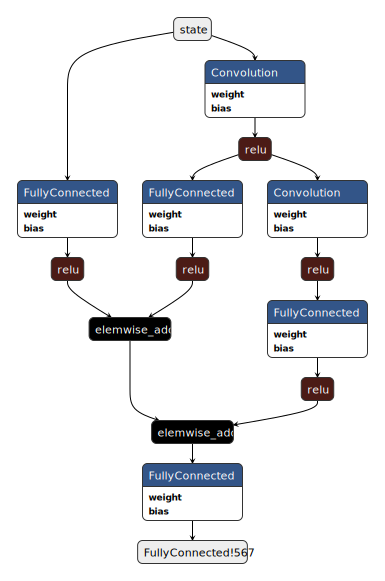

# Description 

F# deep reinforcement learning example. Simple DQN trained on a toy game using epsilon-greedy based decisions with memory replay. The task is simple, player (blue) can move left/right to collect rewards (green) and avoid obstacles (red). Once 10 (default setting) green rewards are missed the game resets.

DQN after training 1000 episodes:


# Running

- "libmxnet" and CUDA libraries must be available for loading
- configure [loadui.fsx](../loadui.fsx) to desired framework (needs editing for dotnet core)
- execute [DQN.fsx](DQN.fsx) in F# interactive.

# Details 
Player is blue, rewards are green and obstacles (not on by default) are red. The gameboard is set to 9x9 pixels with it's representation simply a [3;w;h] array where rgb values are 0.f or 1.f.

## Model
``` fsharp
let boardInput = Input("state", [0; 3; boardWidth; boardHeight])
let labels = Input("qa", [0; actionCount])
let qmodel = 
    let h = 64
    let n1 = boardInput .>> FullyConnected(h, flatten = true) .>> Relu()
    let c1 = boardInput .>> Convolution(numFilter = 32, kernel = [3;3], stride = [1;1], pad = [1;1]) .>> Relu()
    let n2 = c1 .>> FullyConnected(h, flatten = true) .>> Relu()
    let n3 = 
        c1
        .>> Convolution(numFilter = 32, kernel = [3;3], stride = [2;2], pad = [1;1]) .>> Relu()
        .>> FullyConnected(h, flatten = true) .>> Relu()
    (n1 + n2 + n3) .>> FullyConnected(actionCount)

let loss = (qmodel - labels) .>> Square() .>> Mean() .>> MakeLoss()

```

[Netron](https://github.com/lutzroeder/netron) export of model:



## Training process

### Executors
We need to maintain 3 executors for training:
1. As the game is played we need to evaluate our q-network at each step to determine the best action.
2. We need to evaluate the "target" network on `batchSize`
3. We need to train the parameters on `batchSize`

The difference between the training network and the target network can be seen here 
``` fsharp 
/// train using a single batch consisting of last sample and random samples from play memory
let replay (ts : TrainState) = 
    let memory = ts.Memory
    if memory.Count = 0 then failwith "memory empty"
    let inputVar = ts.InputVariable
    let labelVar = ts.LabelVariable
    let execBatch = ts.BatchEvalExecutor
    let execTrain = ts.TrainExecutor
    let batch = 
        [|
            yield memory.Last   // We'll ensure last action is a part of this batch
            yield! Seq.init (batchSz - 1) (fun _ -> memory.Sample(ts.Random))
        |]
    let len = batch.Length
    // evaluate network on each sample state
    let p = 
        let a = makeBatch (batch |> Array.map (fun x -> x.State))
        execBatch.[inputVar].CopyFrom a
        execBatch.Forward(false)
        execBatch.Outputs.[0].ToFloat32Array() |> Array.splitInto len
    // evaluate network on each sample "next state"
    let p_ = 
        let a = makeBatch (batch |> Array.map (fun x -> defaultArg x.NextState initialBoard))
        execBatch.[inputVar].CopyFrom a
        execBatch.Forward(false)
        execBatch.Outputs.[0].ToFloat32Array() |> Array.splitInto len
    // Generate x,y for training
    // With `p` we update the value for the action in which we know the reward
    // p.[actionTaken] <- reward + gamma*bestFutureActionValue
    // where 'bestFutureActionValue' is assumed from the max of given p_
    let x = Array.zeroCreate len
    let y = Array.zeroCreate len
    for i = 0 to len - 1 do
        let b = batch.[i]
        let t = p.[i] |> Array.copy
        t.[b.Action] <- 
            match b.NextState with
            | Some _ -> b.Reward + gamma*(double(Array.max p_.[i])) |> float32
            | None -> b.Reward |> float32
        x.[i] <- b.State
        y.[i] <- t
    execTrain.[labelVar].CopyFrom(y |> Array.concat)
    execTrain.[inputVar].CopyFrom(makeBatch x)
    execTrain.Forward(true)
    execTrain.Backward()
    ts.UpdateStep(ts.LearningRate)
    {ts with 
        LossSum = ts.LossSum + execTrain.Outputs.[0].ToScalar()
        LossCount = ts.LossCount + 1.0
    }
```

Above notice the x,y training pairs are generated using the target network (`execBatch`) to then train the training network (`execTrain`). The target network parameters are copied with 
```fsharp 
/// Copy trained parameters to target network
let copyToTarget() = 
    for a in targetBindings do 
        let scc,b = trainBindings.TryGetValue(a.Name)
        if scc && a.Shape = b.Shape then 
            b.NDArray.Value.CopyTo(a.NDArray.Value)
```
every `updateTargetStepCount` steps. More specifically this is done by passing an `onStep` function to `makeTrainer : onStep -> onEpisode -> TrainerAgent`:
```fsharp 
let trainer = 
    makeTrainer
        (fun ts -> 
            if ts.Steps % updateTargetStepCount = 0 then 
                copyToTarget()
                updateModel ts
            ts
        )
        (fun ts -> 
            let ts = 
                if ts.Episode % printUpdateEpCount = 0 then
                    printfn "Epsilon %10f Steps %d, Episode: %d, Average reward for episode %f, Count %f, LossSum %f, Loss %f, LR: %f"  ts.Epsilon ts.Steps ts.Episode (ts.RewardSum / double printUpdateEpCount) ts.LossCount ts.LossSum (ts.LossSum/ts.LossCount ) ts.LearningRate
                    {ts with 
                        LossCount = 0.0
                        LossSum = 0.0
                        RewardSum = 0.0}
                else
                    ts
            if ts.Episode % learningRateUpdateCount = 0 && ts.LearningRate > minLearningRate then
                {ts with 
                    LearningRate = ts.LearningRate * learningRateDacay |> max minLearningRate}
            else
                ts
        )
```

With the above executors we can then also have a fourth executor for "live play". This network runs on the `CPU 0` context while training happens on `GPU 0`

### Iteration

A single episode is one play of the game till reset (10 rewards missed). On each step (`movesPerUpdate` per reward move) either the best action is taken with probability `1.0 - epsilon` or a random move is made (probability `epsilon`). The resulting state, nextState and reward (a 'sample') is stored in memory (capacity set by `memoryLength`). This new sample along with `batchSize - 1` random samples from memory are then used to train (`replay` function from above). The `run` function is where a single episode takes place:

```fsharp

/// Run a single episode for training        
let run onStep (ts : TrainState)  = 
    let rec loop frameMove (s : GameBoard) (ts : TrainState) = 
        let evalin = ts.EvalExecutor.[ts.InputVariable]
        // mask out invalid moves taking the next best action
        let actionInt = 
            let a = act ts.Epsilon evalin ts.EvalExecutor s 
            let j = 
                if s.Player = 0 && a.[0] = 1 then 
                    1
                elif s.Player = (boardWidth - 1) && a.[0] = 2 then 
                    1
                else
                    0
            a.[j]
        // when movesPerUpdate is hit we force action 'Stay'
        let action, frameMove = 
            match actionInt with
            | _ when frameMove = movesPerUpdate -> Stay, 0
            | 0 -> Stay, 0
            | 1 -> Left, frameMove + 1
            | 2 -> Right, frameMove + 1
            | x -> failwithf "invalid action %d" x
        let s2 =
            match action with 
            | Stay -> 
                // Let the game continue
                gameStep {s with UpdateTime = DateTime.MinValue} DateTime.Now (fun _ -> action) |> Option.map (fun s2 -> {s2 with UpdateTime = DateTime.MinValue})
            | _ -> 
                // Move the player only
                gameStep {s with UpdateTime = DateTime.Now} DateTime.MinValue (fun _ -> action) |> Option.map (fun s2 -> {s2 with UpdateTime = DateTime.MinValue})
        let reward = 
            match s2 with 
            | None -> 0.0
            | Some s2 -> (s2.Score - s.Score |> double) / double rewardValue
        ts.Memory.Add 
            { State = s
              NextState = s2
              Action = actionInt
              Reward = reward }
        let ts = 
            let steps = ts.Steps + 1
            replay 
                {ts with 
                    Steps = steps
                    Epsilon = minEp + (maxEp - minEp)*(exp (-lambda*(double steps)))
                }
        let ts = onStep ts
        match s2 with 
        | None -> ts, s.Score |> double
        | Some s -> loop frameMove s ts
    loop 0 initialBoard ts


```

### Output 

```
Epsilon   0.839253 Steps 2953, Episode: 25, Average reward for episode 57.000000, Count 2953.000000, LossSum 28.019345, Loss 0.009488, LR: 0.001000
Epsilon   0.722375 Steps 5485, Episode: 50, Average reward for episode 79.000000, Count 2532.000000, LossSum 18.755739, Loss 0.007407, LR: 0.001000
Epsilon   0.614998 Steps 8208, Episode: 75, Average reward for episode 89.000000, Count 2723.000000, LossSum 19.206608, Loss 0.007053, LR: 0.001000
Epsilon   0.539517 Steps 10429, Episode: 100, Average reward for episode 77.000000, Count 2221.000000, LossSum 16.179795, Loss 0.007285, LR: 0.001000
Epsilon   0.461784 Steps 13075, Episode: 125, Average reward for episode 107.000000, Count 2646.000000, LossSum 19.993038, Loss 0.007556, LR: 0.001000
Epsilon   0.391803 Steps 15880, Episode: 150, Average reward for episode 128.000000, Count 2805.000000, LossSum 21.602951, Loss 0.007702, LR: 0.001000
Epsilon   0.335892 Steps 18519, Episode: 175, Average reward for episode 140.000000, Count 2639.000000, LossSum 20.869931, Loss 0.007908, LR: 0.001000
Epsilon   0.279057 Steps 21713, Episode: 200, Average reward for episode 216.000000, Count 3194.000000, LossSum 27.370556, Loss 0.008569, LR: 0.001000
Epsilon   0.236849 Steps 24557, Episode: 225, Average reward for episode 227.000000, Count 2844.000000, LossSum 28.080246, Loss 0.009874, LR: 0.001000
Epsilon   0.195053 Steps 27951, Episode: 250, Average reward for episode 268.000000, Count 3394.000000, LossSum 38.820503, Loss 0.011438, LR: 0.001000
Epsilon   0.159033 Steps 31559, Episode: 275, Average reward for episode 317.000000, Count 3608.000000, LossSum 44.924326, Loss 0.012451, LR: 0.001000
Epsilon   0.130796 Steps 35060, Episode: 300, Average reward for episode 340.000000, Count 3501.000000, LossSum 46.270952, Loss 0.013216, LR: 0.001000
Epsilon   0.107248 Steps 38674, Episode: 325, Average reward for episode 373.000000, Count 3614.000000, LossSum 50.403512, Loss 0.013947, LR: 0.001000
Epsilon   0.087659 Steps 42423, Episode: 350, Average reward for episode 413.000000, Count 3749.000000, LossSum 56.182322, Loss 0.014986, LR: 0.001000
Epsilon   0.071453 Steps 46324, Episode: 375, Average reward for episode 423.000000, Count 3901.000000, LossSum 62.217738, Loss 0.015949, LR: 0.001000
Epsilon   0.056723 Steps 50891, Episode: 400, Average reward for episode 561.000000, Count 4567.000000, LossSum 73.896589, Loss 0.016181, LR: 0.001000
Epsilon   0.045503 Steps 55468, Episode: 425, Average reward for episode 581.000000, Count 4577.000000, LossSum 80.852974, Loss 0.017665, LR: 0.001000
Epsilon   0.038123 Steps 59352, Episode: 450, Average reward for episode 499.000000, Count 3884.000000, LossSum 73.538884, Loss 0.018934, LR: 0.001000
Epsilon   0.031506 Steps 63823, Episode: 475, Average reward for episode 603.000000, Count 4471.000000, LossSum 87.744444, Loss 0.019625, LR: 0.001000
Epsilon   0.026403 Steps 68337, Episode: 500, Average reward for episode 627.000000, Count 4514.000000, LossSum 89.207025, Loss 0.019762, LR: 0.001000
Epsilon   0.022722 Steps 72573, Episode: 525, Average reward for episode 552.000000, Count 4236.000000, LossSum 88.052853, Loss 0.020787, LR: 0.001000
Epsilon   0.019898 Steps 76756, Episode: 550, Average reward for episode 564.000000, Count 4183.000000, LossSum 85.427326, Loss 0.020423, LR: 0.001000
Epsilon   0.017418 Steps 81563, Episode: 575, Average reward for episode 678.000000, Count 4807.000000, LossSum 98.908486, Loss 0.020576, LR: 0.001000
Epsilon   0.015394 Steps 86873, Episode: 600, Average reward for episode 731.000000, Count 5310.000000, LossSum 106.897506, Loss 0.020131, LR: 0.001000
Epsilon   0.014012 Steps 91805, Episode: 625, Average reward for episode 691.000000, Count 4932.000000, LossSum 100.438259, Loss 0.020365, LR: 0.001000
Epsilon   0.013056 Steps 96344, Episode: 650, Average reward for episode 654.000000, Count 4539.000000, LossSum 98.475399, Loss 0.021695, LR: 0.001000
Epsilon   0.012247 Steps 101465, Episode: 675, Average reward for episode 750.000000, Count 5121.000000, LossSum 110.899554, Loss 0.021656, LR: 0.001000
Epsilon   0.011636 Steps 106756, Episode: 700, Average reward for episode 781.000000, Count 5291.000000, LossSum 126.065292, Loss 0.023826, LR: 0.001000
Epsilon   0.011213 Steps 111737, Episode: 725, Average reward for episode 706.000000, Count 4981.000000, LossSum 114.303913, Loss 0.022948, LR: 0.001000
Epsilon   0.010896 Steps 116796, Episode: 750, Average reward for episode 724.000000, Count 5059.000000, LossSum 114.417569, Loss 0.022617, LR: 0.001000
Epsilon   0.010660 Steps 121882, Episode: 775, Average reward for episode 728.000000, Count 5086.000000, LossSum 116.830421, Loss 0.022971, LR: 0.001000
Epsilon   0.010492 Steps 126775, Episode: 800, Average reward for episode 711.000000, Count 4893.000000, LossSum 115.339400, Loss 0.023572, LR: 0.001000
Epsilon   0.010353 Steps 132326, Episode: 825, Average reward for episode 828.000000, Count 5551.000000, LossSum 129.576478, Loss 0.023343, LR: 0.001000
Epsilon   0.010243 Steps 138519, Episode: 850, Average reward for episode 901.000000, Count 6193.000000, LossSum 131.729647, Loss 0.021271, LR: 0.001000
Epsilon   0.010172 Steps 144318, Episode: 875, Average reward for episode 839.000000, Count 5799.000000, LossSum 120.418099, Loss 0.020765, LR: 0.001000
Epsilon   0.010121 Steps 150223, Episode: 900, Average reward for episode 870.000000, Count 5905.000000, LossSum 130.611125, Loss 0.022119, LR: 0.001000
Epsilon   0.010083 Steps 156371, Episode: 925, Average reward for episode 906.000000, Count 6148.000000, LossSum 136.082563, Loss 0.022134, LR: 0.001000
Epsilon   0.010059 Steps 162042, Episode: 950, Average reward for episode 871.000000, Count 5671.000000, LossSum 131.959497, Loss 0.023269, LR: 0.001000
Epsilon   0.010041 Steps 168283, Episode: 975, Average reward for episode 928.000000, Count 6241.000000, LossSum 146.372114, Loss 0.023453, LR: 0.001000
Epsilon   0.010028 Steps 174700, Episode: 1000, Average reward for episode 963.000000, Count 6417.000000, LossSum 152.498118, Loss 0.023765, LR: 0.001000
```


Another model trained on a 16x16 board:


